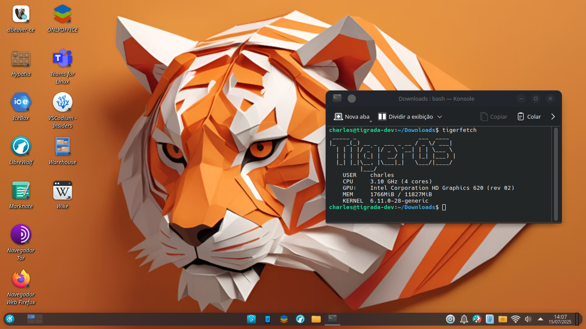

# 🐯 Tigerfetch



Um mini script Python inspirado no Neofetch, focado em exibir informações da CPU. É o desenvolvimento para aplicativos CLI para o [Conteiner do TigerOS](https://github.com/selrahcsan/Conteiner-TigerOS)

## 🔧 O que ele faz no momento

Exibe:

* Frequência máxima da CPU (em GHz, com 2 casas decimais)
* Número total de núcleos lógicos disponíveis
* Memória usada e total (em MiB)
* A versão do kernel em uso
* Escrito TigerOS em Large text
* Cores em arco-íris

### 📦 Exemplo de saída

```bash
 _____ _                  ___  ____  
|_   _(_) __ _  ___ _ __ / _ \/ ___| 
  | | | |/ _` |/ _ \ '__| | | \___ \ 
  | | | | (_| |  __/ |  | |_| |___) |
  |_| |_|\__, |\___|_|   \___/|____/ 
         |___/                       
    USER    charles
    CPU     3.60 GHz (8 cores)
    GPU:    NVIDIA Corporation TU116 [GeForce GTX 1650 SUPER] (rev a1)
    MEM     4200MiB / 7986MiB
    KERNEL  6.15
```

## 🚀 Como usar

### 1. Clone o repositório

```bash
git clone https://github.com/selrahcsan/tigerfetch.git
cd tigerfetch
```

### 2. Instale as dependências

* [`psutil`](https://pypi.org/project/psutil/)
* [`lolcat`](https://github.com/busyloop/lolcat)
* [`figlet`](https://github.com/cmatsuoka/figlet)

```bash
sudo apt install python3-psutil lolcat figlet 
```

### 3. Execute o script

```bash
chmod +x tigerfetch
./tigerfetch
```

## 📁 Estrutura do script

* `get_cpu_info()` – obtém frequência da CPU e núcleos lógicos
* `get_gpu_info()` - obtém a marca e modelo da GPU
* `get_memory()` – obtém memória total e usada (em MiB)
* `tigerfetch()` – imprime as informações

## ✨ Créditos

Projeto Inspirado no falecido [neofetch](https://github.com/dylanaraps/neofetch).

## 📚 Referências

* [thepythoncode](https://thepythoncode.com/article/get-hardware-system-information-python#CPU_info)
* [docs.python.org](https://docs.python.org/3/library/platform.html#platform.machine)
